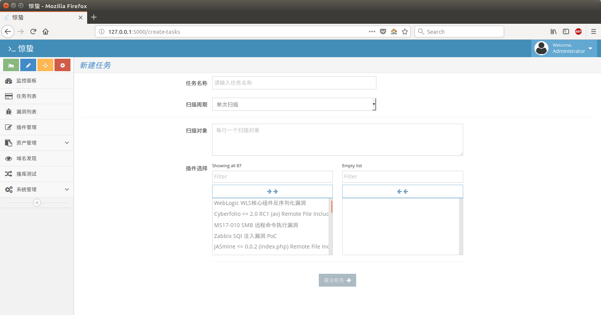
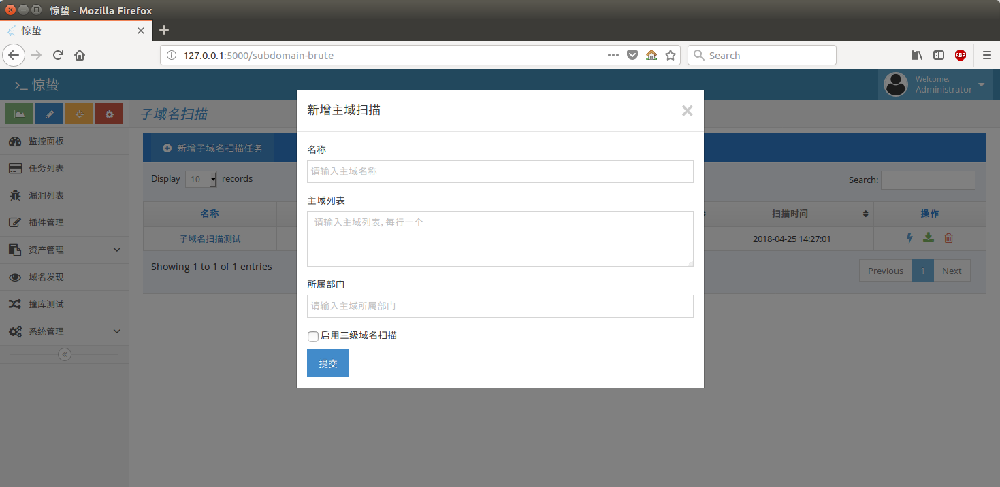

# 惊蛰

本项目是一款基于 Flask 应用框架的漏洞扫描系统，同时集成了渗透测试常用的端口扫描、子域名爆破等功能，后端漏洞扫描采用的是知道创宇安全团队的开源漏洞测试框架 Pocsuite

本项目仅用于测试、学习使用，不得用于其他非法目的

## 截图

## 安装

[安装手册](doc/INSTALL.md)

## 使用

- 漏洞扫描

漏洞扫描调用的 Pocsuite 进行扫描，扫描插件通过 [Seebug](https://www.seebug.org/) 可以获取，或者自己编写。

扫描目标只能是单个 IP 或者 URL，不支持网段扫描（公司是中小型公司，没有这块需求），默认有80余个插件，大多是 Seebug 的免费PoC

任务周期可以选择临时、每日、每周或每月

- 资产管理

添加各系统或部门网络资产

可以通过各资产库创建漏洞扫描任务，同样资产库只能是单个 IP 或者 URL。

开启端口发现功能后，后端会定时调用 nmap 对资产进行端口扫描，需要扫描的端口可以在设置里进行配置

- 域名发现功能

即子域名爆破功能，但目前功能尚不完善，只能通过配置字典进行暴力猜解，域名字典可以在设置处进行配置，项目 tests 文件夹内提供了一份子域名字典（字典来源 ring04h 的 [wydomain](https://github.com/ring04h/wydomain/blob/wydomain2/wydomain.csv) 项目）

## 插件编写

后端扫描功能采用的是 Pocsuite 漏洞测试框架，插件编写请参考 Pocsuite 项目插件编写要求
[PoC 编写规范及要求说明](https://github.com/knownsec/Pocsuite/blob/master/docs/CODING.md)，或从[Seebug 社区](https://www.seebug.org/)获取漏洞插件

## 参考及依赖项目

- [Pocsuite](https://github.com/knownsec/Pocsuite)
- [wydomain](https://github.com/ring04h/wydomain)
- [xunfeng](https://github.com/ysrc/xunfeng)
- [Flask](https://github.com/pallets/flask)
- [Nmap](https://github.com/nmap/nmap)

## 联系我

- Telegram:[jeffzhang](https://t.me/jeffzhang)
- Telegram Group:[惊蛰](https://t.me/joinchat/IoDZvA3_v2g0EYxURQsu5Q)
- E-Mail:jeffzh3ng@gmail.com
