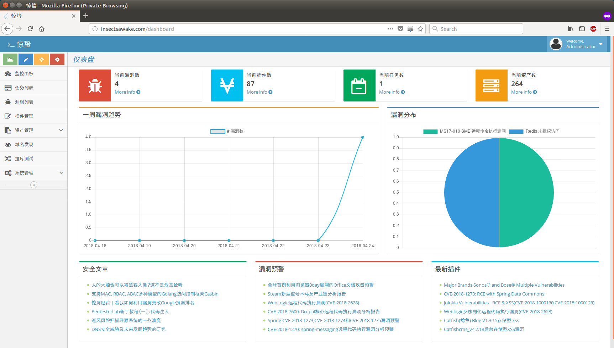

# 惊蛰

本项目是一款基于 Flask 应用框架的漏洞扫描系统，同时集成了渗透测试常用的端口扫描、子域名爆破等功能，后端漏洞扫描采用的是知道创宇安全团队的开源漏洞测试框架 Pocsuite

本项目仅用于测试、学习使用，不得用于其他非法目的

## 截图

## 安装

[安装手册](doc/INSTALL.md)

## 使用

目前已经实现漏洞扫描、域名爆破及企业内网资产端口扫描功能

## 插件编写

后端扫描功能采用的是 Pocsuite 漏洞测试框架，插件编写请参考 Pocsuite 项目插件编写要求
[PoC 编写规范及要求说明](https://github.com/knownsec/Pocsuite/blob/master/docs/CODING.md)，或从[Seebug 社区](https://www.seebug.org/)获取漏洞插件

## 参考及依赖项目

- [Pocsuite](https://github.com/knownsec/Pocsuite)
- [wydomain](https://github.com/ring04h/wydomain)
- [xunfeng](https://github.com/ysrc/xunfeng)
- [Flask](https://github.com/pallets/flask)
- [Nmap](https://github.com/nmap/nmap)

## 联系我

- Telegram:[jeffzhang](https://t.me/jeffzhang)
- Telegram Group:[Insects Awake](https://t.me/joinchat/IoDZvA3_v2g0EYxURQsu5Q)
- E-Mail:jeffzh3ng@gmail.com